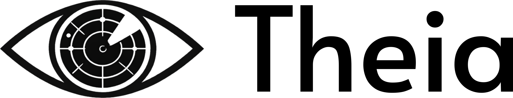
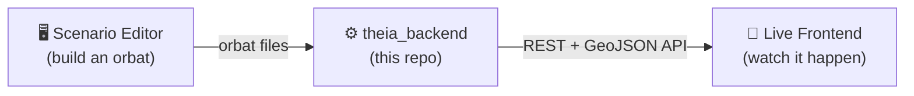

<p align="center">
  
</p>

<p align="center">
  An open source agent-based simulation framework for integrated air defence.
</p>

<p align="center">
  
  
  
</p>

Theia simulates integrated air defence (IAD) to assess the consequences of
an operational concept for sensors and effectors, compare variants, and
evaluate their performance against various hostile forces. It is
developed by the Swiss Armed Forces, and is inspired by, and loosely
based on, the open source code
[openBURST](https://github.com/Swiss-Armed-Forces/openburst).

Existing open source simulation frameworks for defence tend to fall into
one of two categories: some simulate physics and sensors in specific
situations without modelling decision-making, others simplify the sensor
network — usually omitting tracking altogether — to focus on complex
behaviour. Theia aims to fill that gap. To the best of our knowledge, it
is the only framework that is:

- **Open source.**
- **Multi-sensor** — detects targets across heterogeneous sensor networks,
  including active radar, PCL, PET, and visual sensors.
- **Fusion-capable** — combines detections from multiple sensors and prior
  knowledge into a unified situational picture, using tracking algorithms
  from frameworks such as [Stone Soup](https://github.com/dstl/Stone-Soup/).
- **Behaviour-aware** — models high-level decision-making under
  incomplete information, informed by the simulated situational picture
  ("if you cannot see it, you cannot react to it"): target assignment,
  emission control, movement, and more.
- **Visual and scriptable** — ships a GUI, but runs just as well headless for
  batch analysis.

## What questions can it answer?

All from the same simulation output:

- **How effective is a sensor placement?** Theia simulates hostile forces
  and friendly detections simultaneously, fuses them into tracks, and
  reports geometric coverage, detection performance (e.g. "x% of enemy
  ballistic missiles were tracked with error < y%"), and resilience to
  sensor loss.
- **How effective is an effector placement?** Theia simulates detection,
  fusion, and probabilistic engagement, reporting coverage, battle
  performance (e.g. "x% of detected drones eliminated before y metres"),
  and ammunition stockpile/throughput requirements.
- **How do sensor placement decisions propagate to battle outcome?**
- **What's the best force design?** Compare force package configurations,
  identify bottlenecks, and run trade-off analyses across competing goals
  (e.g. ballistic missile defence vs. drone defence).

## How it fits together

Theia is split across three repositories that talk to each other only
through this backend's HTTP API:



| Repository | Role |
| --- | --- |
| **theia_backend** (this repo) | Simulation engine, physics/tracking models, and the API server everything else talks to. |
| [theia_scenario_editor](https://github.com/Swiss-Armed-Forces/theia_scenario_editor) | GUI for placing sensors/effectors and assembling an order of battle. |
| [theia_frontend](https://github.com/Swiss-Armed-Forces/theia_frontend) | GUI for live visualisation of a running simulation. |

## Getting started

```bash
poetry install
poetry run python scripts/run_server.py
```

That starts a standalone server on `http://localhost:8000` with interactive
API docs at [`/docs`](http://localhost:8000/docs). See the documentation for the full picture, such as downloading terrain data, running an actual scenario, and the concepts behind the physics and tracking models:

- [Installation](doc/source/installation.rst)
- [Running the server](doc/source/running.rst)
- [API docs](doc/source/api.rst)
- [Concepts: physics model](doc/source/concepts/physics_model.rst) & [architecture](doc/source/concepts/architecture.rst)
- [API reference](doc/source/index.rst) (autogenerated — build locally with `cd doc && poetry run make html`, output in `doc/build/html/`)

## Project status

Theia is early-stage software. Expect breaking changes as the
architecture and APIs settle.

## Contributing

Issues and pull requests are welcome. Since the project is still moving
fast, it's worth opening an issue to discuss non-trivial changes before
investing time in a PR.

For development (running tests, building docs, cutting a release), see
[Development](#development) below.

## License

TODO: a license has not been finalized yet.

## Acknowledgments

- [openBURST](https://github.com/Swiss-Armed-Forces/openburst), which
  inspired this project.
- [Stone Soup](https://github.com/dstl/Stone-Soup/), used for tracking.
- Barton's *Radar System Analysis and Modeling*, the basis for Theia's
  detection models (see the [physics model docs](doc/source/concepts/physics_model.rst)).

---

## Development

### Running unit tests

```bash
python -m unittest discover tests
```

### Building the documentation

```bash
cd doc/
poetry run make html
```

The HTML output is written to `doc/build/html/index.html`.

### Publishing a new release

The package version is inferred from git tags (semantic versioning):

```bash
git tag v1.2.3   # insert your version
git push; git push --tags
poetry install
```

Verify the correct version was picked up with `poetry version`.
