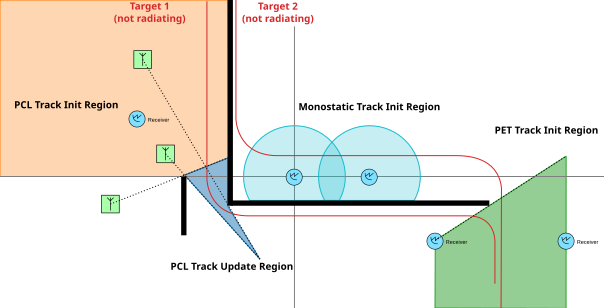
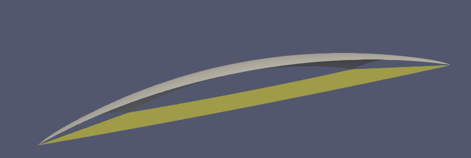

Demo Scenario
=============

Goal
----

The demo scenario showcases the capabilities of theia and how it can be used. The
following aspects must be visible:

- Sensor portfolio (monostatic, PCL, PET)
- Tracking
- Scaling (speedup vs. realtime simulation)

The demo scenario does NOT aim to be reasonable from a military or physical point
of view; its sole purposes are to demonstrate technical capabilities and contribute
to the verification and validation since it can be run and easily analyzed before
each release. This validates the tracker.

Capability Demo
---------------

Overview
........

Terrain
.......

The demo scenario must be easily interpretable. A simplified terrain model is used
for this purpose. Therefore, a "flat surface model" is used instead of the
usual terrain model defined by the SRTM dataset [srtm]_. Fig. :numref:`flat-earth`
displays the spherical terrain model without any elevation
(constant altitude 0 meters above sea level; gray) to the flat earth terrain model
that covers roughly Europe without Scandinavia, i. e.
:math:`\mathrm{lat} \in [ 34.01624, 55.97380 ]°, \mathrm{lon} \in [ -11.85964, 38.14561 ]` (yellow).

   Usual spherical terrain model (altitude constant 0 meters above sea level; gray)
   and flat earth model (yellow).

On top of this general terrain, a few elevations of height ``1000m`` are added.

Sensors and Targets
...................

BLUE Sensors:

- 3 PCL Sensors (1 receiver, 3 transmitters)
- 2 Monostatic active radars
- 2 PET receivers

RED targets:

- 1 target without radiation (constant speed ``300 m/s``)
- 1 target with radiation (constant speed ``300 m/s``)

Expected behaviour
..................

Both targets start moving at the same time. ``Target 1`` is detected by the PCL
sensors, which initiate a track. After performing a turn, the target looses
line-of-sight to the PCL receiver and transmitters, which causes the deletion
of the track after the patience time.

``Target 2`` starts undetected. Its track is initiated by the monostatic sensors,
but deleted after the target has left the detection range. After flying a curve,
the target is detected by the PET receivers.

The RED situational picture contains only the monostatic detectors and the PCL
transmitters, but not the receivers.

.. [srtm] NASA Shuttle Radar Topography Mission (SRTM)(2013).
          Shuttle Radar Topography Mission (SRTM) Global.
          Distributed by OpenTopography.
          https://doi.org/10.5069/G9445JDF.
          Accessed 2026-05-19