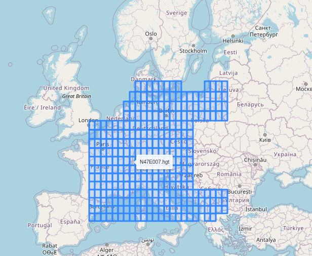

Installation
=============

Prerequisites
--------------

Install `poetry <https://python-poetry.org/docs/#installation>`_. Theia
requires Python 3.12 or later.

Installing the package
------------------------

.. code-block:: bash

   poetry install

Terrain data
-------------

Theia uses `SRTM <https://doi.org/10.5067/MEASURES/SRTM/SRTMGL1.003>`_
elevation tiles (``.hgt`` files) to account for terrain occlusion and earth
curvature. Place the tiles you need for your scenario's region in the
directory pointed to by the ``THEIA_DEFAULT_TERRAIN`` environment variable.

For faster repeated line-of-sight queries over a fixed region, a
precomputed terrain tree can be built with ``scripts/create_terrain.py``.
See :mod:`theia.terrain_fast_los` for details.

Downloading data files
^^^^^^^^^^^^^^^^^^^^^^

Click "Data Access" on the Earthdata page, then click "Earthdata Search".
Use the "spatial" tool to select a area-of-interest (AOI).
Finally, download the ``.hgt`` files for your region in your AOI.
Save the files in ``THEIA_DEFAULT_TERRAIN``.

Testing terrain data
^^^^^^^^^^^^^^^^^^^^

You can check whether Theia recognises your files by running the following code
in a Jupyter notebook:

.. code-block:: python3
   
   import folium

   from theia.terrain import SrtmTerrainModel

   m = folium.Map()

   rects = SrtmTerrainModel().covered_region()
   for rect in rects:
       folium.GeoJson(
           rect.model_dump_json(),
           tooltip=rect.properties["name"],
       ).add_to(m)
   m

This will show an interactive map similar to the following:



Building a fast terrain model
^^^^^^^^^^^^^^^^^^^^^^^^^^^^^

Theia supports a fast terrain model based on hierarchical bounding volumes.
While not necessary to run simulations, it accelerates computations significantly.
These files can be generated using the script ```scripts/create_terrain.py```.

1. Enter the latitude, longitude extent for which you would like to create the
   terrain model.
2. Execute the Python script.
3. Move the script to the directory indicated by the environment variable
   ``THEIA_HBV_TERRAIN_DATA_DIR``.


Example scenarios and sensor configurations
---------------------------------------------

The ``scenarios/`` directory contains example scenario files (e.g. ballistic
missile defence, drone defence, static and mobile deployments) that can be
used as a starting point.

The ``data/default_configurations/`` directory contains default sensor
configurations (radar, SHORAD, surveillance). These are parametrised after
public specifications of real systems where possible — for example, the
default active radar configuration is derived from the Hensoldt TRML-4D
radar used in the IRIS-T SLM system.

.. todo::

   Document the offline/local map tile server setup used as a fallback by
   the scenario editor and frontend when public tile servers (OpenStreetMap,
   ArcGIS) are unreachable.
