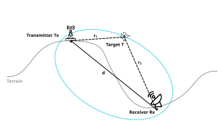
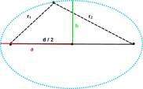

Passive Radar Detections
========================

Introduction
------------

The transmitter (``Tx``; antenna to the left) emits a radio signal that is
reflected by the target (``T``; airplane) and then received
by the receiver (``Rx``; satellite dish to the right). The total distance travelled
by the signal is called the bistatic range :math:`R = r_1 + r_2`.

Detection
---------

A bistatic detection consists of a tuple :math:`(R, \Delta f)`,
where the quantity :math:`\Delta f` denotes the Doppler shift of the signal
due to the target's motion.

Therefore, the target's position cannot be measured directly. It is only known
that it lies on an ellipsoid with focal points at ``Tx`` and ``Rx``. This section
will derive the equations that determine the ellipsis.

    Setup of the bistatic radar scenario. Without loss of generality, the
    Cartesian coordinate system is rotate such that the axis between transmitter
    and receiver, the major semi-axis, is aligned with the x-axis and centered
    at the origin.

Equation for the detection ellipsoid
------------------------------------

The equation of an ellipsoid in Cartesian coordinates is given by

.. math::

    \frac{x^2}{a^2} + \frac{y^2}{b^2} + \frac{z^2}{c^2} = 1.

Using rotational symmetry around the axis ``Tx - Rx``, we obtain the equation

.. math::
    \frac{x^2}{a^2} + \frac{y^2 + z^2}{b^2} = 1.

Consider the point :math:`(-a, 0)`. Due to symmetry, for this point,
:math:`R = r_1 + r_2 = 2a`, which implies :math:`a = \frac{1}{2} R`.
For determining ``b``, consider the point at :math:`(0, b)`.
Pythagoras' Theorem states that :math:`b^2 + {\frac{1}{2} d}^2 = (\frac{1}{2} R)^2`.
Consequently, :math:`b = \frac{1}{2} \sqrt{R^2 - d^2}`.

Finally, the equation of the detection ellipsoid is given by

.. math::

    \frac{x^2}{\frac{1}{2}R} + \frac{y^2 + z^2}{\frac{1}{2} \sqrt{R^2 - d^2}} = 1.

Sampling the ellipsoid
----------------------

First, rotate the coordinate system s. t. the ellipsoid's major axis is aligned
with the x-axis and centered at the origin.

Then, we can use the polar parametrization of an ellipsoid [Wikipedia]_:

.. math::

    x &= a\sin\theta\cos\varphi,\\
    y &= b\sin\theta\sin\varphi,\\
    z &= c\cos\theta,

where the quantity :math:`\theta \in [0, \pi]` denotes the polar angle ("latitude")
and :math:`\varphi \in [0, 2\pi]` the azimuth ("longitude").

Sampling the angles equidistantly is a straightforward and efficient way to generate
points on the ellipsoid surface. However, the resulting points will not be equidistant!

.. [Wikipedia] https://en.wikipedia.org/wiki/Ellipsoid#Parameterization